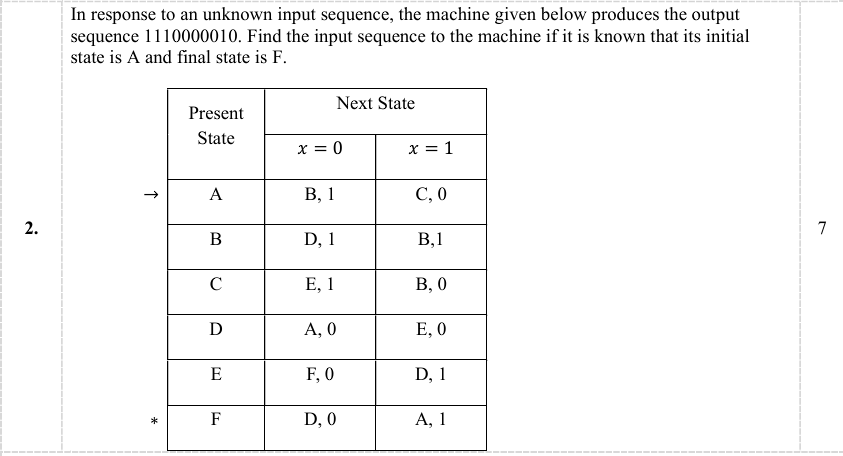

<!-- my first programming language which i leaned on the 1st year of my graduation -->

# ***#1: Getting Started with C Programming| C Programming for Beginners***  

[](https://youtu.be/KnvbUiSxvbM?si=KHH5YlK5jjFIlLuk)

# ***#2: C Variables and Print Output | C Programming for Beginners***  

[](https://youtu.be/h4VBpylsjJc?si=3x0GZjAQZ0Qxu9aU)

# ***#3: Data Types in C Programming | C Programming for Beginners***  

[](https://youtu.be/sARaqR0hRI4?si=3JF81emkAwDw1u3W)

# ***#4: Get User Input in C Programming***  

[](https://youtu.be/17gp5DJEyiw?si=MegWV2vALpD9jJdy)

# ***#5: Comments in C Programming | C Programming for Beginners***  

[](https://youtu.be/L2H2rtCLB-0?si=mb60Og3ZMhqxQMM4)

# ***#6: C Operators | C Programming for Beginners***  

[](https://youtu.be/_57FcSBtJNU?si=dYFSinNTynC3P2YM)

# ***#7: Type Conversion in C | Implicit and Explicit Type Conversion***

[](https://youtu.be/xi2wf0Zy2Y4?si=YbWoSBbHtlKZPYHl)

# ***#8: Boolean and Comparison Operators in C Programming***  

[](https://youtu.be/TybmJxXRV80?si=EKttYYo9-JjlcPu4)

# ***#9: If Else Statements in C | C Programming for Beginners***  

[](https://youtu.be/K8mntKyBJGc?si=38__svvQ5WoTnDZb)

* ***C is a general purpose procedural programming language***. *good for memory management and internal tasks examples used in embedded system, OS, compiler, drivers, etc.*
* *C language is not generally used for software devlopment*
* *compiler based programming language are C, C++, Java, Python, etc.*
* *interpreter based programming language are Javascript, Ruby, PHP, etc.*

> i. procedural programming language(C programming language), ii. object oriented programming language, iii. functional programming language.

C is not object oriented programming language

`(Dennis Ritchie in 1972 at Bell Labs developed C).`
Here's your content restyled and formatted properly in **Markdown**:

---

### 🔑 Predefined Reserved Word (Keyword-32)

* C has **32 predefined reserved keywords**.
* These **keywords** are reserved and **cannot be used as variable names**.

---

### 🧮 Memory Allocation by Default

* **All variables** are stored in **stack memory** by default in C.

```c
int a;
```

* Here, variable `a`:

  * is **mutable**
  * gets memory allocated in the **stack** (unless `register` is used)

---

### ⚙️ `register` Keyword Example

```c
register int a;
```

* **`register`** suggests the compiler to **store variable `a` in a CPU register** instead of RAM (for faster access).
* `int` is 4 bytes = 32 bits (because 1 byte = 8 bits).
* Other data type sizes (may vary by system):

  * `double`: 8 bytes
  * `char`: 1 byte

---

### 🆔 Identifiers

* Identifiers are **names used to identify**:

  * Variables (`variable_name`)
  * Functions
  * Arrays, etc.
* Example: `int score;` → `score` is an **identifier**

---

### 🖨️ `printf()` Function

* `printf()` is defined in the **`<stdio.h>`** header file.
* `stdio.h` stands for **Standard Input/Output**.

```c
#include <stdio.h>

int main() {
    printf("Hello, world!\n");
    return 0;
}
```

---

### ⚙️ Compilation Flow of a C Program

1. **Preprocessing**
   `#include` directives and macros are handled by the **preprocessor**.
2. **Compilation**
   Preprocessed code is **converted to assembly code**.
3. **Assembly**
   Assembly code is translated into **object code** (`.obj` or `.o`).
4. **Linking**
   Linker combines the object file(s) and **library files** (e.g., standard library) to produce an executable (`.exe`).
5. **Loading & Execution**
   The **loader** loads the executable into **memory** and starts execution.

---


```
Preprocessing → Compilation → Assembly → Linking → Executable → [Loaded by OS for execution]
```

format specifier

```
%d - integer
%f - float
%c - char
%s - string
short int - %hd
long int - %ld
long long int - %lld
unsigned int - %u
unsigned long int - %lu
unsigned long long int - %llu
double - %lf
```

---

The **storage class** of a variable determines where the variable is stored—either in memory or CPU registers. It also defines the **scope** and **initial value** of the variable. In the C programming language, there are four storage classes: **automatic**, **register**, **static**, and **external**.

* **auto** — Automatic storage class: All variables defined within a function or block belong to the automatic storage class by default.
* **register** — Register storage class
* **static** — Static storage class
* **extern** — External storage class

### Automatic Storage Class

All variables defined within a function or block, either by default or with the `auto` specifier, belong to the automatic storage class. Automatic variables are local to the block in which they are defined, and their lifetime ends when the program exits the block.

### Register Storage Class

The `register` specifier declares a variable of the register storage class. Variables declared as `register` are local to the block in which they are defined and are destroyed upon exiting the block. Register variables are stored in CPU registers rather than memory, which can result in faster access.

### Static Storage Class

The `static` specifier declares a variable of the static storage class. Static variables are global to the program and persist across multiple function calls. However, static variables are not visible outside the function in which they are declared. These variables are stored in memory.

### External Storage Class

The `extern` specifier gives a variable the external storage class. No storage is allocated for an `extern` variable within the declaring file. It is assumed that the variable has already been defined elsewhere in the program. Because an `extern` variable is only declared and not defined, it cannot be initialized at the point of declaration.

---

In programming, **actual parameters** refer to the values passed to a function during a function call, whereas **formal parameters** are the variables defined in the function’s signature that receive these values.

---

# ***Theory of Computation***

## ***An introduction to the subject of Theory of Computation and Automata Theory***

[](https://youtu.be/58N2N7zJGrQ?si=1Ao_uwyVAoQjp58H)

Topics discussed:  
1. What is Theory of Computation?  
2. What is the main concept behind the subject Theory of Computation?  
3. Some simple examples explaining the scope of TOC.  
4. A brief overview of the topics in Theory of Computation.

[](https://youtu.be/V19S3Mqfrzo?si=rlEFyLye04OLOwFz)

**Topics Discussed:**  
- Introduction to Theory of Computation  
- LAG (Language, Automata, Grammar)  
- Symbol  
- Alphabet  
- String  
- Language  
- Examples

[](https://youtu.be/aoUEXRlvmxc?si=qszI_Fig5Le-TsCO)

**Topics Discussed:**  
- Introduction to Automata  
- Language  
- Example of Language  
- Automata  

[](https://youtu.be/4Q2rE6R31GU?si=4Jw0DP3NSAGWMOqG)

**Topics Discussed:**  
- Introduction  
- Power of Σ (Sigma)  
- Sigma Star (Kleene Closure)  
- Positive Closure  

[](https://youtu.be/5Jd54dxQ1_Q?si=GC10B5rdn3G8DoMn)

**Topics Discussed:**  
- Grammar and its importance in formal language theory  
- Examples of grammar rules  
- Checking strings using grammar  

## ***TOC: The prerequisites of Finite State Machine (FSM) in Theory of Computation***

[](https://youtu.be/TpIBUeyOuv8?si=gIlJdYwQJTTMKSDi)

Topics discussed:  
1. Symbols in FSM  
2. Alphabets in FSM  
3. Strings in FSM  
4. Languages in FSM  
5. Powers of sigma in FSM  
6. Cardinality in FSM

## ***TOC: Finite State Machine (Finite Automata) in Theory of Computation***

[](https://youtu.be/Qa6csfkK7_I?si=_ga1j8v5rHdQt1Fm)


**TOC: Finite State Machine (Finite Automata) in Theory of Computation**  
Topics discussed:  
1. The Basics of Finite State Machine  
2. Finite Automata  
3. Types of Finite Automata  
4. Deterministic Finite Automata (DFA)  
5. The formal definition of Deterministic Finite Automata (DFA)

[](https://youtu.be/CiXJnosT0UE?si=_-oSixlYjRNvL4kk)

**Lecture 6: What is DFA in TOC with Examples (in Hindi)**  
**Topics Discussed:**  
- Definition and components of DFA (Q, Σ, δ, q₀, F)  
- Determinism in DFA  
- Example and DFA design  
- DFA transition explanation

[](https://youtu.be/vsEKN2f22bE?si=V9OS2YkAXyavF9CG)

**Lecture 7: DFA Example 1 | How to Construct DFA in TOC**  
**Instructor:** Varun Sir  
**Problem Statement:**  
Solved designing a DFA over the alphabet **{a, b}** that recognizes the language consisting of **all strings containing at least one 'a'**.

**Topics Covered:**  
- Language analysis (strings containing 'a')  
- Step-by-step DFA construction  

## ***Deterministic Finite Automata (Example 1)***

[](https://youtu.be/40i4PKpM0cI?si=A1Y8IbtywQy_LEm3)

**Deterministic Finite Automata (Example 1)**  
TOC: An example of DFA that accepts all binary strings starting with `'0'`.  
This lecture demonstrates how to construct a DFA that accepts such strings and rejects all others.

[](https://youtu.be/cEX7V3c2CWc?si=95AF-QlqpOCXIUCM)

**Lecture 8: DFA Example 2 | DFA of Language with All Strings Ending with 'a'**  
**Instructor:** Varun Sir  
**Problem Statement:**  
Solved designing a DFA over the alphabet **{a, b}** that recognizes the language consisting of **all strings that end with 'a'**.

**Topics Covered:**  
- Language analysis (strings ending in 'a')  
- Step-by-step DFA construction  

## ***Deterministic Finite Automata (Example 2)***

[](https://youtu.be/2KindKcLjos?si=pivmA4YjGFd1iMUk)

**Deterministic Finite Automata (Example 2)**  
TOC: An example of a DFA that accepts all strings over `{0,1}` of length 2.  
This lecture shows how to construct a DFA that accepts binary strings of exactly two characters and rejects all others.

[](https://youtu.be/v9IwDI0GtpE?si=vKnspVo5ZcX7an3f)

**Lecture 9: DFA of Language with All Strings Starting with 'a' & Ending with 'b'**  
**Problem Statement:**  
Design a DFA over the alphabet **{a, b}** that recognizes the language consisting of **all strings that start with 'a' and end with 'b'**.

**Topics Covered:**  
- Language analysis (strings starting with 'a' and ending with 'b')  
- Step-by-step DFA construction

[](https://youtu.be/gUeh54lmlik?si=CMzmmesLv03uH_Q8)

**Lecture 10: DFA of Language with All Strings Not Starting with 'a' OR Not Ending with 'b'**  

**Problem Statement:**  
Designing a DFA over the alphabet **{a, b}** that recognizes the language consisting of all strings **that do NOT start with 'a' OR do NOT end with 'b'**.

**Topics Covered:**  
- Language definition using **De Morgan's Theorem**  
- DFA for strings starting with 'a' & ending with 'b'  
- Complement of DFA to handle the negation case 

[](https://youtu.be/4BDz876IJBc?si=rQcuqs9su6CvxxWg)

**Lecture 14: DFA vs NFA in TOC**  

**Description:**  
**differences between DFA (Deterministic Finite Automaton)** and **NFA (Nondeterministic Finite Automaton)** in Hindi, with examples.  

**Topics Covered:**  
- Structural differences between DFA and NFA  
- Language recognition power of DFA vs NFA  
- Examples to highlight the contrast  

## ***Deterministic Finite Automata (Example 3)***  

[](https://youtu.be/_2cKtLkdwnc?si=tpm0ZMAFlqsvH5kp)

TOC: An example of a DFA that accepts all strings over `{a, b}` that **do not** contain the substring `'aabb'`.  
This lecture shows how to construct such a DFA and reject only those strings that include `'aabb'`.

## ***Deterministic Finite Automata (Example 4)*** 

[](https://youtu.be/Fpmr1nHqYrw?si=VEL1BYhjhr7Y8VVG)

TOC: An example showing how to determine what a DFA recognizes.  
This lecture also explains how to **complete a DFA using a Dead State**, helping better understand how a given DFA processes input strings.

## ***Regular Languages | TOC*** 

[](https://youtu.be/WrzaPNj9OZ4?si=0hnWgl8zijNixjEJ)

Topics Discussed:  
1. Regular Languages in Theory of Computation  
2. Non-Regular Languages in TOC  
3. Examples of Languages that are Not Regular 

[](https://youtu.be/6aRJQNYYz4s?si=zFjhTZm6nKqc7E4O)

**Operations on Regular Languages | TOC**  
Topics Discussed:  
1. Union Operation on Regular Languages  
2. Concatenation Operation on Regular Languages  
3. Star Operation on Regular Languages  
4. Theorems on Union and Concatenation  

[](https://youtu.be/ehy0jGIYRtE?si=OU5xMTYtG1f-zwHX)

**TOC: Non-deterministic Finite Automata**  
Topics Discussed:  
1. Properties of Deterministic Finite Automata (DFA)  
2. Properties of Non-Deterministic Finite Automata (NFA)  
3. Difference between DFA and NFA  

[](https://youtu.be/egXhe55dAIk?si=2l9LpOefvCkV3VGF)

**TOC: The Formal Definition of Non-deterministic Finite Automata**  
Topics Discussed:  
the formal definition of NFA and each of the tuples is explained with special focus on the transition function.

[](https://youtu.be/4bjqVsoy6bA?si=hvQdnX7pFVJCFnTv)

**TOC: NFA Solved Problem 1**  
Topics Discussed:  
An example showing the behavior of NFA and showing in what conditions does an NFA accept or reject.

[](https://youtu.be/Bcen1W_uFEU?si=NnDJEFjB8-aHnayv)

**Non-Deterministic Finite Automata (Solved Example 2)**  
Topics Discussed:  
1. An example of NFA which accepts all strings that start with "0".  
2. An example of NFA which accepts all strings over {0,1} of length two.

[](https://youtu.be/NGF-b3QVeJU?si=wCVvStu8o897Qr1E)

**TOC: NFA Solved Problem 3**  
Topics Discussed:  
1. NFA for: L1 = {Set of all strings that end with "1"}  
2. NFA for: L2 = {Set of all strings that contain "0"}  
3. NFA for: L3 = {Set of all strings that start with "10"}  
4. NFA for: L4 = {Set of all strings that contain "01"}  
5. NFA for: L5 = {Set of all strings that end with "11"}

[](https://youtu.be/--CSVsFIDng?si=gHl1EObwWsMSQFRp)

**TOC: Conversion of Non-deterministic Finite Automata (NFA) to Deterministic Finite Automata (DFA)**  
Topics Discussed:  
1. How NFA and DFA are equivalent and the process of converting NFA to DFA.  
2. Equivalence of NFA and DFA.  
3. Example: Converting the NFA for a language that accepts all strings that start with '0' to its equivalent DFA.

[](https://youtu.be/pnyXgIXpKnc?si=jjJasxxP_SKJzpYs)

**TOC: Problem Number 1 on Conversion of Non-deterministic Finite Automata (NFA) to Deterministic Finite Automata (DFA)**  
Topics Discussed:  
conversion of an NFA that accepts all binary strings over {0,1} that end with '1' to its equivalent DFA using the **Subset Construction Method**.

[](https://youtu.be/i-fk9o46oVY?si=e3c2AjZ5yolF2oSR)

**TOC: Problem Number 2 on Conversion of Non-deterministic Finite Automata (NFA) to Deterministic Finite Automata (DFA)**  
Topics Discussed:  
conversion of a given NFA to its equivalent DFA using the **Subset Construction Method**, demonstrating the equivalence of NFA and DFA.

[](https://youtu.be/dY1bCC6syLI?si=djR6Pi1IlKFsh9lg)

**TOC: Problem Number 3 on Conversion of Non-deterministic Finite Automata (NFA) to Deterministic Finite Automata (DFA)**  
Topics Discussed:  
Conversion of an NFA that accepts all strings over {0,1} ending with `"01"` into its equivalent DFA using the **Subset Construction Method**.

[](https://youtu.be/Y92dtMnarAU?si=A7fYHDld18NKS121)

**TOC: Problem Number 4 on Conversion of Non-deterministic Finite Automata (NFA) to Deterministic Finite Automata (DFA)**  
Topics Discussed:  
Design an NFA that accepts all strings over {0,1} where the second last symbol is always `'1'`. After designing the NFA, Converting it to an equivalent DFA using the **Subset Construction Method**.

[](https://youtu.be/84oNUttWlN4?si=amZXPhxxll3qwiND)

**TOC: Epsilon NFA** 
Topics Discussed: 
Epsilon NFA, how it is defined, and how it differs from the normal NFA.

[](https://youtu.be/WSGcmaHNBFM?si=ajjljEHeyChk5_Ou)

**TOC: Conversion of Epsilon NFA to NFA**  
Topics Discussed: Conversion of an Epsilon NFA to its equivalent NFA.

[](https://youtu.be/I6GFKekMr7s?si=25nBxWd-XjRkqjhM)

**TOC: Conversion of Epsilon NFA to NFA - Examples (Part 1)**  
Conversion of a given Epsilon NFA to its equivalent NFA.

[](https://youtu.be/Jz4YQ09nOxA?si=g83n3889SzC77Enj)

**TOC: Conversion of Epsilon NFA to NFA - Examples (Part 2)**  
Conversion given Epsilon NFA to its equivalent NFA using step-by-step examples.

[](https://youtu.be/upu_TeZImN0?si=SVzNyMh-jZyjZaQ9)

**TOC: Regular Expression – Introduction and Rules**  
The basic **rules**, **symbols**, and **operations** used to define regular languages through regular expressions.

[](https://youtu.be/paOPoZyjzdg?si=BRCV18EnVkKYuVnb)

**TOC: Regular Expression – Examples**  
**sets of strings** using **regular expressions**.

[](https://youtu.be/yp4pYgXfYD8?si=AEmz6S3wCYNlAat7)

**TOC: Identities of Regular Expression**  

[](https://youtu.be/Idl_0mPzZjE?si=Y18VQWEd_-6QLchf)

**TOC: Arden’s Theorem**

> the proof of Arden’s Theorem which states that: If P and Q are two Regular Expressions over Σ and if P does not contain Є, then the equation given by R=Q+RP has a unique solution i.e. R=QP*

[](https://youtu.be/TkqcPh0BFUw?si=l14yFVegEIuHHC97)

**TOC: An Example Proof using Identities of Regular Expressions**

> Shows how to prove (1+00*1)+(1+00*1)(0+10*1)*(0+10*1) is equal to 0*1(0+10*1)* using Identities of Regular Expression.

[](https://youtu.be/FOhEmW_nMRs?si=9s9IQQE-6oOY0RRA)

**TOC: Designing Regular Expressions**  
Demonstrates how to design Regular Expressions for the following Languages:

1. Language accepting strings of **length exactly 2**  
2. Language accepting strings of **length at least 2**  
3. Language accepting strings of **length at most 2**

[](https://youtu.be/OKFrju0HB7k?si=ZiKPgLdX61weMebc)

**TOC: NFA to Regular Expression Conversion**  
Topics Discussed:  
1. **Conversion process** of NFA (Non-deterministic Finite Automaton) to Regular Expression  
2. **Conversion process** of NFA (Non-deterministic Finite Automaton) to Regular Expression example 

[](https://youtu.be/RxfXyvfTsgQ?si=DJIVNDxTsFlplxDR)

**TOC: Conversion of Regular Expression to Finite Automata**  
Shows how to convert Regular Expressions to their equivalent Finite Automata.

[](https://youtu.be/62JAy4oH6lU?si=LkjplLcDbBW3QuUo)

**TOC: Conversion of Regular Expression to Finite Automata - Examples (Part 1)**  
Shows how to convert Regular Expressions to their equivalent Finite Automata.

[](https://youtu.be/dikEDuepOtI?si=A4MmUu_e5t_pbhJ0)

**TOC: Pumping Lemma (For Regular Languages)**  
The concept of Pumping Lemma, which is used to prove that a language is **not regular**.

[](https://youtu.be/Ty9tpikilAo?si=bO3huymbevOM1Bcx)

**TOC: Pumping Lemma (For Regular Languages) | Example 1**  
**Example** of how to prove that a given language is **Not Regular** using **Pumping Lemma**.

[](https://youtu.be/kZzH8E-s-9o?si=KsmiAmcEVb13FM_v)

**TOC: Pumping Lemma (For Regular Languages) | Example 2**  
**Example** of how to prove that a given language is **Not Regular** using the **Pumping Lemma**.

[](https://youtu.be/WgEsPTAL55Q?si=1N9GeVmbqxQgHQOo)

**Topics Discussed:**  
1. Types of Grammar according to **Noam Chomsky**  
2. **Grammar**  
3. **Regular Grammar**  
4. Types of Regular Grammar: **Right Linear Grammar** & **Left Linear Grammar**



[](https://youtu.be/vIwxS-sG8-4?si=tPgB-Rm-Cl8eiflH)

# ***The description of Moore Machine in TOC with example — Finite set of states, input symbol, transition function, start state, output symbol, and output function.***

[](https://youtu.be/_88FzOc9GzA?si=GSaHn829vQ7t2sTM)

# ***Lec-21: Mealy Machine in TOC | Formal Definition | Mealy Machine in Hindi***

[](https://youtu.be/kikut5SJVTE?si=uXFwi50XE7dmiotj)

# ***TOC: Minimization of Deterministic Finite Automata (DFA) in Theory of Computation — Minimization process, need for minimization, and equivalence of states.***

[](https://youtu.be/hOzc4BUIXRk?si=kCftEYuwh2y_feUm)

# ***TOC: Minimization of DFA - Examples (Part 1)***

[](https://youtu.be/0XaGAkY09Wc?si=cVwsGwFroQ6mIphu)

# ***Basics of regular part | TOC | THEORY OF COMPUTATION | AUTOMATA | COMPUTER SCIENCE | part-10***

[](https://youtu.be/CFa2x8QOr-8?si=ndy0l5JbP0c1_6h1)

# ***Lec-47: What is Context free grammar in TOC | Formal Definition***

[](https://youtu.be/SlSA9vEXCm4?si=y1VmhUv0tBwXdCjw)

# ***Lec-48: Convert Context free language to Context free grammar with examples | TOC***

[](https://youtu.be/eDAOxyZkl68?si=vFAyQislg9lIFAEN)

# ***Pushdown Automata (Introduction)***

[](https://youtu.be/4ejIAmp_Atw?si=BcJVryeOC4YCTFcD)

# ***Pushdown Automata (Formal Definition)***

[](https://youtu.be/JtRyd7Svlew?si=aBpxRvX2c5gkg88S)

# ***TOC: Pushdown Automata (Graphical Notation)***

[](https://youtu.be/eY7fwj5jvC4?si=TnaLdl3j3ONPAzhe)

**Topics Discussed:**
1. Graphical notation of pushdown automata  
2. Input symbol  
3. Pop and push symbols  
4. Example of PDA construction  

# ***TOC: Pushdown Automata Example – Even Palindrome (Part 1)***

[](https://youtu.be/TEQcJybMMFU?si=ceWxcJTeC4i-17eF)

**Topics Discussed:**
1. Construction of PDA that accepts even palindromes over the symbols {a, b}  
2. Palindromes  
3. Palindrome examples  
4. Even and odd palindromes  

# ***9.4 aⁿbⁿ example | Pushdown Automata | Design PDA in Theory Of Computation | Automata Theory***

[](https://youtu.be/vClPjqb2rAY?si=Uqt-_P4s5dNX2Chh)

# ***Lec-51: Design PDA for 0ⁿ1²ⁿ CFL Language***

[](https://youtu.be/fc7wLWiDNBM?si=3YtH7A0MuGIKJYMY)

# ***Lec-51: Design PDA for 0ⁿ1²ⁿ CFL Language***

[](https://youtu.be/fc7wLWiDNBM?si=3YtH7A0MuGIKJYMY)

[](https://youtu.be/0OgKbFx3mH0?si=h-kJnXEIIwrtvgWT)

# ***Kleene Closure | TOC | THEORY OF COMPUTATION | AUTOMATA | COMPUTER SCIENCE | part-8***

[](https://youtu.be/Lp_FFsY5CLw?si=5vmcNSsJp0wbz6QD)

# ***Lec-4: Power of Sigma Σ in TOC | Kleene closure in TOC***

[](https://youtu.be/4Q2rE6R31GU?si=Plo-QIQh7CKf21u7)

**Description:**  
"Power of Σ" refers to the expressive capabilities or computational strength of the alphabet Σ and the languages that can be constructed over that alphabet.

**Topics Discussed:**
- Introduction  
- Power of Sigma  
- Sigma Star (Kleene closure)  
- Positive Closure  

# ***1.4 What is Kleene Closure ∑* and Positive Closure ∑+ | Theory of Computation | Automata Theory***

[](https://youtu.be/u9McYuXTYVY?si=GmXntuM2jik_LR9K)

# ***Derivation Tree (Left & Right Derivation Trees)***

[](https://youtu.be/u4-rpIlV9NI?si=VH4fYZ1ov5Iz_BZi)

# ***TOC: Ambiguous Grammar | Ambiguous Grammars and Example***

[](https://youtu.be/wQjppolFdas?si=pDC4cP9vFQkIMKdL)

# ***Ambiguous Grammar | Unambiguous Grammar***

[](https://youtu.be/qw1PH2CX_f0?si=3GNNMWd3WyXQC_h2)

# ***Check Whether Grammar is Ambiguous or Not***

[](https://youtu.be/WYkALp7lnTs?si=G5vFD3AgrmiQjOnT)

# ***Check Whether the Given Grammar is Ambiguous or Not***

[](https://youtu.be/xkyCnzDCfGw?si=ClRxnOxztLHioKH1)

# ***3.13 Practice Problem for NFA to DFA Conversion In Hindi | Practice Question for NFA to DFA | TOC***

[](https://youtu.be/SKz4A4wUc68?si=w_qZcVg6Q3S9J803)

# ***TOC: Minimization of DFA - Examples (Part 2)***

[](https://youtu.be/ex9sPLq5CRg?si=VkqK96IS7qXWAyiL)

# ***Pumping Lemma (For Regular Languages) | Example 2***

[](https://youtu.be/kZzH8E-s-9o?si=19SJva32jyp2xcLV)

# ***6.8 Problem Solving on Regular Grammar | Important PYQs on Regular Grammar | Theory of Computation***

[](https://youtu.be/9JtmTDrMUZU?si=VMDPfgp0CKbSQqfu)

# ***Grammar Production Rules and Different Types | Theory of Computation***

[](https://youtu.be/8Th7KB0uEqs?si=n-FH7ASpSm9Z1Bsh)

# ***2.2 How to Design Deterministic Finite Automata (DFA) | Theory of Computation | Automata Theory***

[](https://youtu.be/00cXiux2Kjk?si=uachjn4yzoy3QgPZ)

# ***Lec-12: DFA of all binary strings divisible by 3 | DFA Example 5***

[](https://youtu.be/DNDQdd4VLR4?si=wlsl9jXM-ncFAYUV)


<h1 style="color: #FEDE00; font-family: Arial, sans-serif; font-weight: bold; font-size: 40px; text-decoration: underline;">
  Software Engineering
</h1>


# ***1.6 Software Development Life Cycle | Waterfall Model | Software Engineering***

[](https://youtu.be/xNwtCtxfSuM?si=hDPuCdeX1dZ8XQUk)

> Software development organization follows some process when developing a s/w product, in mature organization this is well defined and managed. In SDLC we development s/w in a systematic and disciplined manner.

> SDLC will define entry and exit for every stage. It makes assessment possible, time prediction, cost prediction, scheduling, to identify faults early possible.

> Selection of a correct development model play an important role in cost, quality, overall success of the project.

Here is the text from the image exactly as it appears:

---

**Waterfall Model**

* Developed in the 1970s by Winston W. Royce.

* Inspired by manufacturing and construction processes, where each step relies on the completion of the previous one.


# ***C Programming Most Important MCQ For JECA 2022 [PART-1] | MCQ For JECA 2022 | JECA Exam***

[![C Programming Most Important MCQ For JECA 2022 [PART-1] | MCQ For JECA 2022 | JECA Exam](https://img.youtube.com/vi/kIO31GoN_40/0.jpg)](https://youtu.be/kIO31GoN_40?si=hOSdUGxpzf2YJUVv)

# ***AI Complete OneShot Course for Beginners | Learn AI & ML Fundamentals from Scratch***

[](https://youtu.be/D1eL1EnxXXQ?si=gsjaCSR2ag1Iavmy)

# ***Solutions of Mock Test Results | C Programming | JECA Exam Preparation 2025***

[](https://youtu.be/P3giFSZzfr4?si=ppCgSlsKuFTgj1UB)

# ***Important JECA 50 MCQ Questions & Answers for DBMS | JECA Exam 2025 Preparation***

[](https://youtu.be/nkSYa-0aar8?si=nshli2kyKiqcNiVZ)

# ***JECA 50 C++ Important MCQ Questions & Answers | JECA Exam 2025 Preparation***

[](https://youtu.be/9qargAd4aaU?si=IUkY0HIoggAy0Rs3)

# ***JECA Top 25 Important MCQs on Object Oriented Programming in C++ | OOPs in C++***

[](https://youtu.be/ig4liEW_fqc?si=WgJdrrK-O6b2Fr_a)

# ***Important JECA 50 MCQ Questions & Answers for Software Engineering | JECA Exam 2025 Preparation***

[](https://youtu.be/IYkzJ5m6Tnw?si=vUaRtm_I5NMfDUyu)

# ***Important UNIX MCQ Questions & Answers for JECA Exam Preparation | JECA 2025***

[](https://youtu.be/2N_ZZY_NuRc?si=NsKBR5k1n2w91RkD)

# ***JECA Important NETWORK MCQ Questions & Answers for JECA EXAM | JECA 2025***

[](https://youtu.be/i3XrDUg31R4?si=4CO7FL1qNlZmLYah)

# ***JECA 50 Important MCQ Questions & Answers for Machine Learning | JECA Exam 2025 Preparation***

[](https://youtu.be/G3_pdNfn-Uo?si=R8HkbWRfALoIQeeM)

# ***MCA***
 
- ***Can be two to three years***
- ***Going to be held on 30 june***
- ***Timing around 2hrs***

## ***Analysis of question***

- ***Total number of questions = 100***

- ***Total marks = 120***

- ***There are two categories***

### ***Category-1***

- 80 ***MCQ Questions***

- ***With 4 Options***

- ***Carries 1 mark each***

- ***Will be carrying Nagative marks***
  - 1/4 = 0.25 = 25%

- ***Only one could be correct***

### ***Category-2***

- 20 ***MCQ Questions***

- ***With 4 Options***

- ***Carries 2 mark each***

- ***Will be carrying no Nagative marking***

- ***Multiple options could be correct***

## ***Syllabus***

- ***C programming***
- ***OOPS***
- ***Computer Networks***
- ***OS***
- ***Computer Archetechture***
- ***DSA***
- ***DBMS***
- ***Software Engineering***
- ***Machine Learning***

# ***Certificate of Participation***

[](https://github.com/SumantaBhattacharya/C-programming-exercises/blob/main/f0baaf53-6424-43d5-8dcd-9a4cbc8a1fbe.jpg?raw=true)

<!-- 
# ***Digital Image Processing***

[](https://youtu.be/wVE8SFMSBJ0?si=wO8unJOLaw6oBYdb)

[](https://youtu.be/qt1UfF0fn4w?si=AzUJ8mKG0L-jG60_)

[](https://youtu.be/_QjxbQKY4ds?si=GZQf3Ip3QZHp57CF)

[](https://youtu.be/7AlwDYmjrcs?si=7hJivf4q73-R4kcT)

[](https://youtu.be/G8yp6f9V_6c?si=Zl9z8s3crce2NUuw)

[](https://youtu.be/lOEBsQodtEQ?si=edGDVk90q7SNv7hZ)

[](https://youtu.be/uNP6ZwQ3r6A?si=eQpGsLmK5aE750vt)

[](https://youtu.be/hUC1uoigH6s?si=T97BKqeBVap6mjQG)

[](https://youtu.be/XRBc_xkZREg?si=hwpiRihl7EAhL7hb)

[](https://youtu.be/fiDDn_F9U74?si=BFzxdEiB97TNdABN)

[](https://youtu.be/t1GXMvK9m84?si=vRKu8VBbBXzccjHe)

[](https://youtu.be/hL1aHfrDFPs?si=L5XbA63_qtLzdd3z)


[](https://youtu.be/jCznifrIkf0?si=-elLmA_Ri5_QdI_J)


 -->
